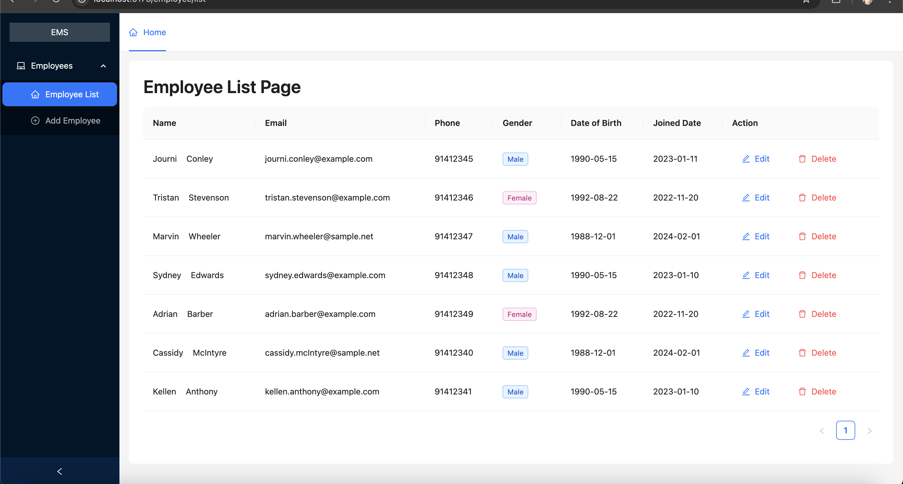
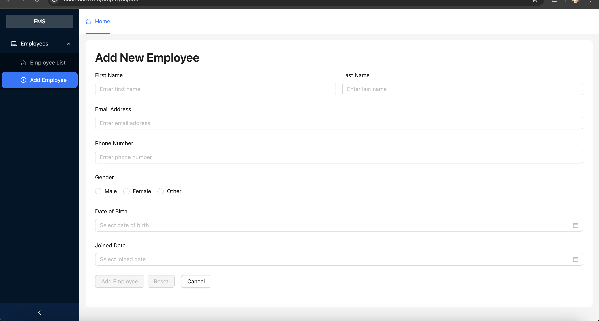
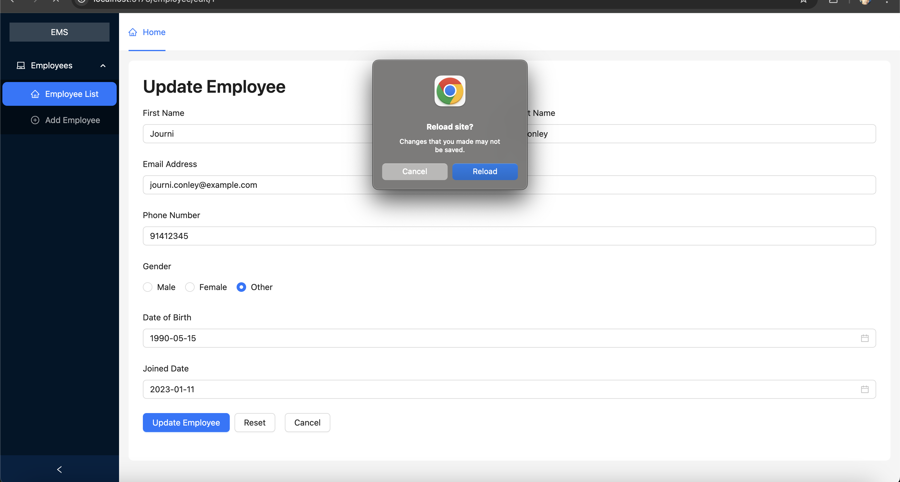
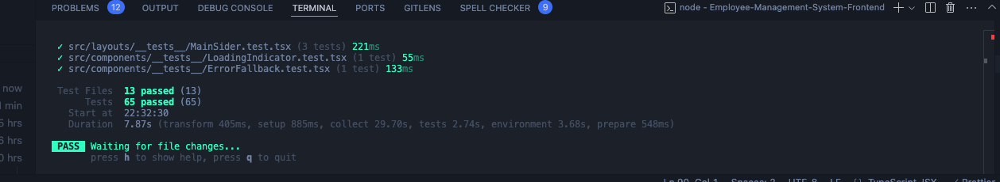
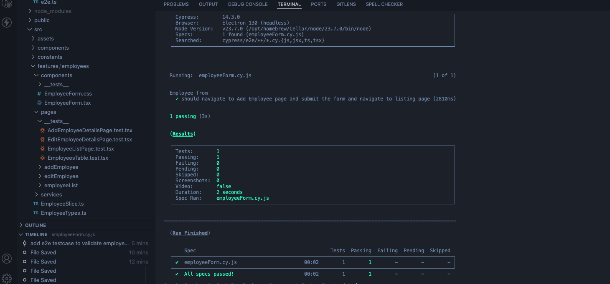

# Employee-Management-System

The goal of this project is to create an Employee Management System that will enable users to efficiently view, add, update, and delete employee details. Furthermore, the system will provide a complete listing of all employees.

# Employee-Management-System-Frontend

This includes frontend development codebase

## Table of Contents

- [Getting Started](#getting-started)
  - [Prerequisites](#prerequisites)
  - [Cloning the Repository](#cloning-the-repository)
  - [Installing Dependencies](#installing-dependencies)
  - [Setting Up Local Environment](#setting-up-local-environment)
- [Running the Project](#running-the-project)
- [Run Vitest](#run-vitest)
- [Run Cypress Testing](#run-cypress-testing)
- [Backend Project Setup](#backend-project-setup)

## Getting Started

This section will guide you through the initial setup to get the frontend project running on your local machine.

### Prerequisites

Before you begin, ensure you have the following installed on your system:

- **Node.js:** (Recommended version >= 16.0.0) You can download it from [nodejs.org](https://nodejs.org/). You can check your installed version by running `node -v` in your terminal.
- **npm** (usually installed with Node.js) or **yarn** (optional, can be installed via `npm install -g yarn`). You can check your installed version by running `npm -v` or `yarn --version` in your terminal.
- **Git:** (Recommended) For version control and cloning the repository. You can download it from [git-scm.com](https://git-scm.com/).

### Cloning the Repository

To get a local copy of the project, use the following command in your terminal:

```bash
git clone https://github.com/janaka120/Employee-Management-System.git
```

### Installing Dependencies

```bash
cd Employee-Management-System-Frontend
```

Then, install the necessary dependencies. You can use either npm or yarn:

Using npm:

```bash
npm install
```

Using yarn:

```bash
yarn install
```

### Setting Up Local Environment

Open the .env file and modify the values according to your local development setup. This includes `VITE_API_BASE_URL`, by default it's using

`VITE_API_BASE_URL=http://localhost:3000/api`

## Running the Project

Once you have installed the dependencies and set up your local environment, you can start the development server using one of the following commands:

Using npm:

```bash
npm run dev
```

Using yarn:

```bash
yarn dev
```

After running this command, the project should be accessible in your web browser, usually at http://localhost:5173. The terminal will often display the exact URL where the development server is running.

## Run Vitest

Run all tests in terminal

```bash
npm run test
```

## Run Cypress Testing

This project uses [Cypress](https://www.cypress.io/) for end-to-end testing.

```bash
npx cypress open
```

To run in headless mode (useful for CI):

```bash
npx cypress run
```

#### Test Directory

All tests are stored in:

```bash
/cypress/e2e/
```

#### Base URL

Make sure the dev server is running: **Frontend**

```bash
npm run dev
```

Make sure the dev server is running: **Backend** http://localhost:3000

```bash
cd Employee-Management-System-Backend
npm run dev
```

# Employee-Management-System-Backend | Node.js + Express.js API

This includes all the REST APIs required to run the **Employee-Management-System-Frontend** project. Backend development codebase - Node JS, Express JS

## Backend Project Setup

This project is a simple Express.js API starter. Follow the steps below to run the project locally.

## Prerequisites

- Node.js (v16 or higher)
- npm or yarn

### Installation

1. Clone the repository

```bash
git clone https://github.com/janaka120/Employee-Management-System.git
cd Employee-Management-System-Backend
```

2. Install dependencies

Using npm:

```bash
npm install
```

Or using yarn:

```bash
yarn install
```

### Run the Server

Using npm:

```bash
npm run dev
```

Or with yarn:

```bash
yarn dev
```

### Server Running At

This is the default url backend server runs **http://localhost:3000**

## Cypress Test Video

A demo video of the **"Add Product"** flow recorded using Cypress is included in the project.

- **Location**: `cypress/videos/add-product.spec.cy.js.mp4`

You can watch the video to see how the form is filled and submitted successfully using end-to-end testing.

### Screenshots:

Home Page: 
Add Employee Page: 
Unsave Data Notification: 

### Test Results

Vitest Test Results: 
Cypress E2E Test Results: 

### Development Assumptions

During the development of the "User Navigates Away Warning for Unsaved Changes" feature, the following assumption was made:

- **Navigation Away Warning on Unsaved Changes:** The warning displayed to the user when attempting to navigate away from the form with unsaved changes is only effective upon a **full page refresh**. If the user navigates to another part of the application through in-app routing without a full refresh, the warning mechanism might not be triggered. This behavior is specific to the current implementation and might be addressed in future iterations.
